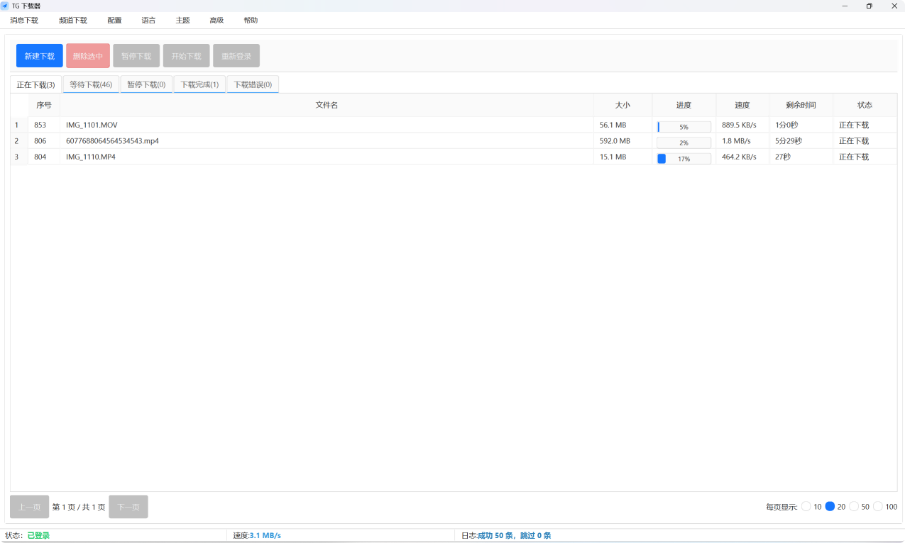
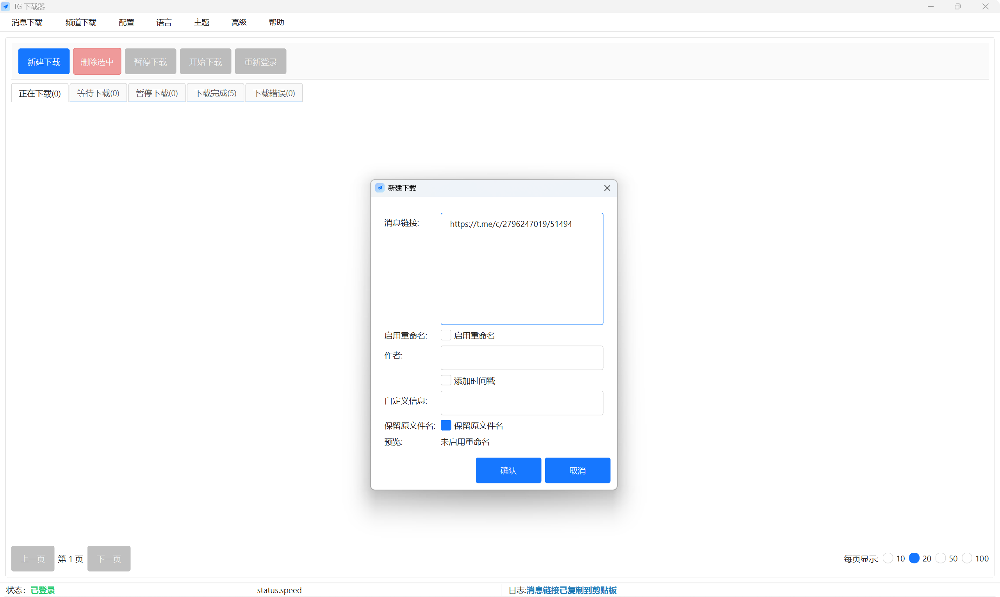
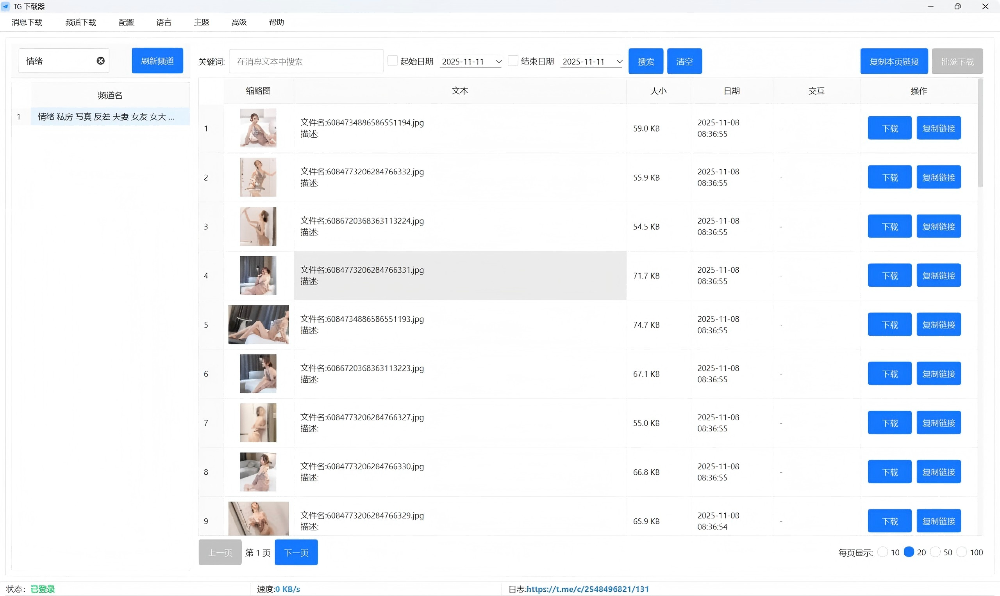
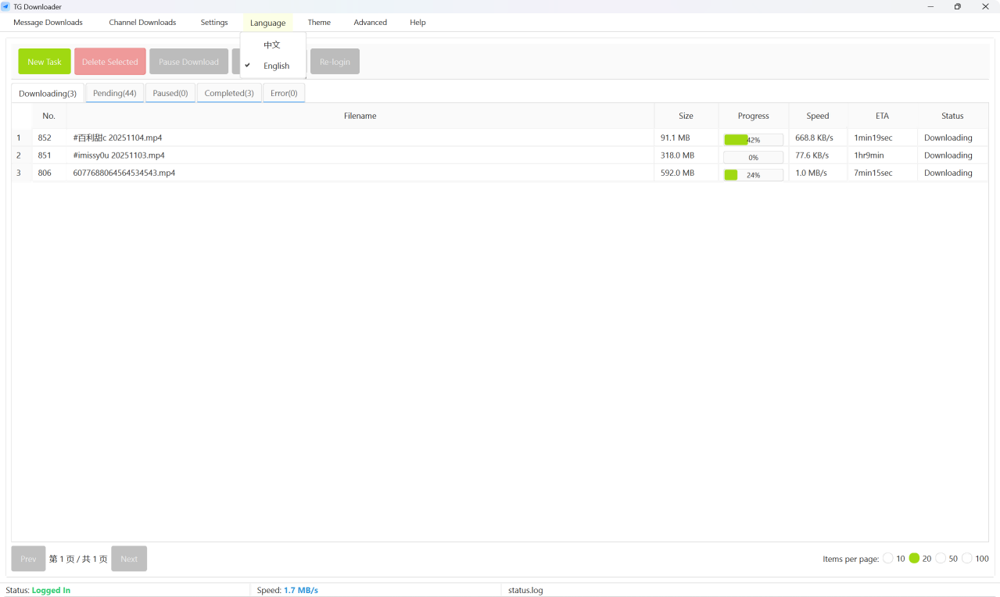
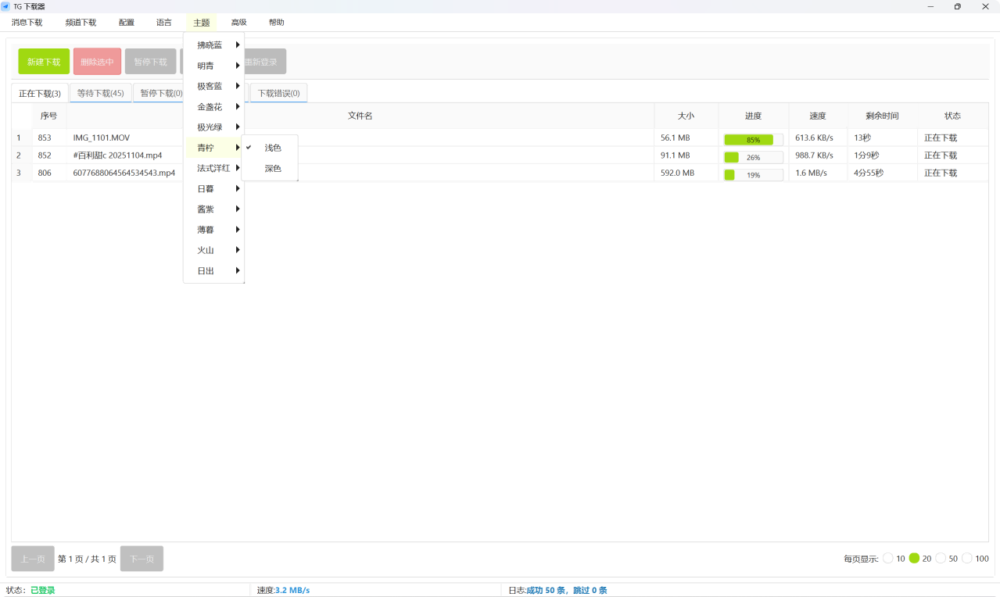
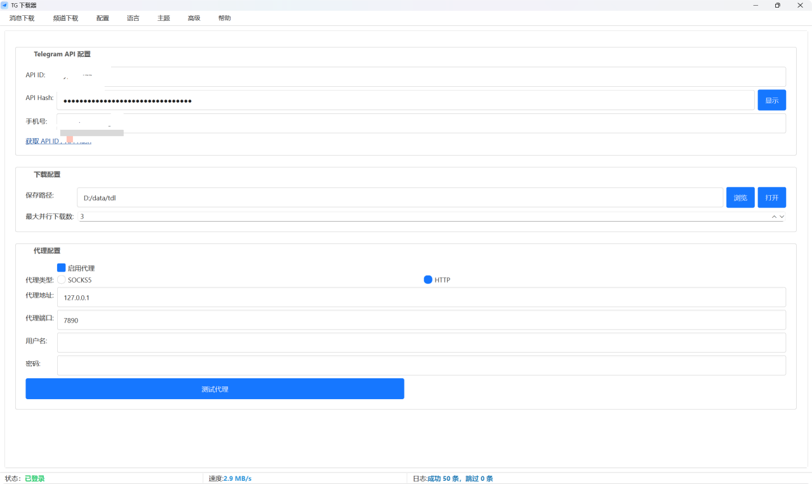
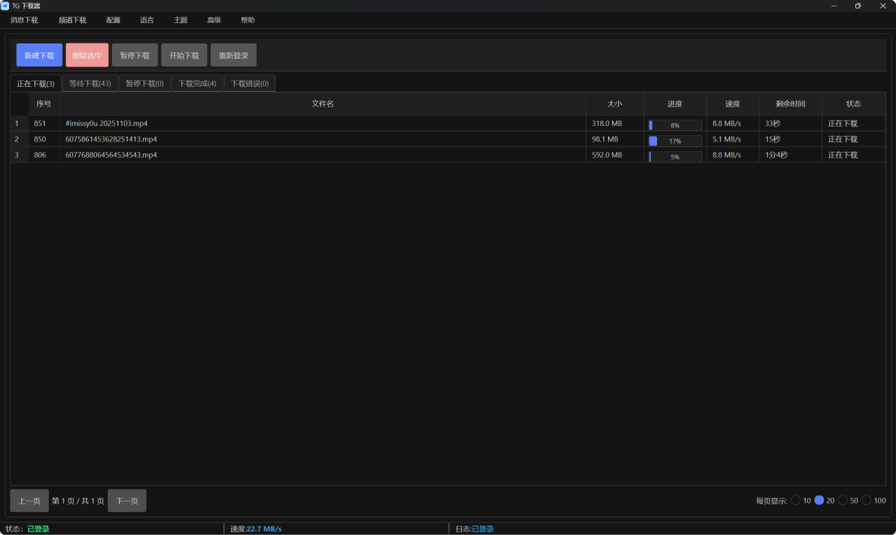

<div align="center">

# 🚀 TG下载助手

### 最简单的 Telegram 内容下载工具

**无需配置 API | 无需登录 | 开箱即用**  
**一键下载 Telegram 消息、频道内容、批量保存媒体文件**

[](https://td.gewu.dev/)
[](https://t.me/gewurj)
[](https://td.gewu.dev/)



### 🎉 无需 API 配置，下载即用！

</div>

---

## ✨ 核心功能

<table>
<tr>
<td width="50%">

### 📥 消息下载（免费）
**无需登录，直接使用！**  
复制任意 Telegram 消息链接，一键下载图片、视频、文件等所有媒体内容



</td>
<td width="50%">

### 📺 频道下载（高级）
**无需配置，即刻体验！**  
浏览并下载 Telegram 频道中的所有媒体文件，支持筛选和批量操作



</td>
</tr>
</table>

### 🔥 独家特性

- ⚡ **开箱即用** - 无需配置 API，无需登录账号，下载即可使用
- 🎯 **零门槛使用** - 告别繁琐的 API 申请流程，真正的一键下载
- 🔓 **突破保存限制** - 下载设置了"禁止保存媒体"的频道内容
- 📱 **下载受保护内容** - 下载显示灰色图标的受保护媒体文件
- 📦 **批量下载** - 支持按日期范围、文件类型筛选批量下载
- 💾 **本地保存** - 所有文件保存在本地，不上传任何内容
- 🔒 **隐私安全** - 无需登录账号，数据完全私密
- 🌍 **多语言支持** - 支持中文、英文等多种界面语言

<div align="center">
 
</div>

## 🚀 快速开始

### 📦 下载安装

<div align="center">

**[⬇️ 立即下载 TG下载助手](https://td.gewu.dev/)**

支持 Windows 10/11 | 完全免费使用 | 无需配置

</div>

### ⚡ 两步开始使用

<table>
<tr>
<td align="center" width="50%">

### 1️⃣ 下载软件
访问官网下载安装包  
双击安装，无需任何配置

</td>
<td align="center" width="50%">

### 2️⃣ 开始下载
复制 Telegram 消息链接  
粘贴即可一键下载

</td>
</tr>
</table>

<div align="center">

### 🎬 就是这么简单！

**无需申请 API | 无需登录账号 | 无需复杂配置**

只需复制链接，点击下载，完成！



</div>

### 📖 使用教程

查看完整使用指南：**[使用文档](https://td.gewu.dev/guide)** | **[视频教程](https://td.gewu.dev/video)** | **[常见问题](https://td.gewu.dev/faq)**


---

## 🎯 告别繁琐，真正的一键下载

<div align="center">

### 传统工具 vs TG下载助手

<table>
<tr>
<td width="50%" align="center">

#### 😰 传统工具使用流程

```
1. 访问 my.telegram.org
2. 申请 API ID 和 API Hash
3. 等待审核通过
4. 登录 Telegram 账号
5. 填写验证码
6. 配置各种参数
7. 终于可以开始下载...
```

**耗时：10-30分钟** ⏰

</td>
<td width="50%" align="center">

#### 🚀 TG下载助手使用流程

```
1. 下载软件
2. 复制链接
3. 点击下载
```

**耗时：30秒** ⚡

</td>
</tr>
</table>

### 💯 零门槛使用，人人都能轻松上手！

</div>

---

## 💡 为什么选择 TG下载助手？

<table>
<tr>
<td align="center" width="25%">

### ⚡ 开箱即用
**无需 API 配置**  
下载即可使用

</td>
<td align="center" width="25%">

### 🆓 完全免费
基础功能永久免费  
无需订阅或付费

</td>
<td align="center" width="25%">

### 🔒 安全私密
无需登录账号  
本地保存不上传

</td>
<td align="center" width="25%">

### 🎨 精美易用
支持多主题多语言  
界面美观操作简单

</td>
</tr>
</table>

<div align="center">

### ✨ 与其他工具对比

| 功能特性 | TG下载助手 | 其他工具 |
|:---:|:---:|:---:|
| 需要 API 配置 | ❌ **不需要** | ✅ 需要 |
| 需要登录账号 | ❌ **不需要** | ✅ 需要 |
| 使用门槛 | 🟢 **极低** | 🔴 较高 |
| 下载速度 | 🚀 **极快** | 🐌 一般 |
| 突破限制 | ✅ **支持** | ❌ 不支持 |
| 批量下载 | ✅ **支持** | ⚠️ 有限 |
| 本地保存 | ✅ **支持** | ✅ 支持 |
| 界面美观度 | ⭐⭐⭐⭐⭐ | ⭐⭐⭐ |

</div>

<div align="center">

</div>

---

## 🤝 支持与反馈

<div align="center">

### 📞 联系我们

[](https://td.gewu.dev/)
[](https://t.me/gewurj)
[](mailto:gewu@aliyun.com)

**加入我们的 [Telegram 群组](https://t.me/gewurj) 获取最新更新和技术支持！**

</div>

---

## ⚠️ 重要说明

> **开箱即用**：无需申请 API、无需登录账号，下载即可直接使用  
> **隐私安全**：所有文件保存在本地，不会上传任何内容到服务器  
> **安全可靠**：无需破解客户端，无需提供个人信息，使用安全  
> **第三方工具**：本工具为第三方工具，与 Telegram 官方无直接关联  
> **使用规范**：请遵守当地法律与平台使用规范，合理合法使用本工具

## 📄 更多信息

- 📋 [功能特性详情](https://td.gewu.dev/features)
- 📚 [完整使用文档](https://td.gewu.dev/guide)
- 🎬 [视频使用教程](https://td.gewu.dev/video)
- ❓ [常见问题解答](https://td.gewu.dev/faq)
- 🔐 [隐私政策](https://td.gewu.dev/privacy)
- 📜 [用户协议](https://td.gewu.dev/terms)
- 📝 [版本更新记录](https://td.gewu.dev/version)

---

<div align="center">

### ⭐ 如果觉得好用，请给我们一个 Star！⭐

**无需 API 配置 | 30秒上手 | 完全免费**

**Made with ❤️ by TG下载助手团队**

[](https://td.gewu.dev/)
[](https://t.me/gewurj)
[](https://td.gewu.dev/guide)

### 🎉 无需等待，立即体验最简单的 Telegram 下载工具！

</div>
